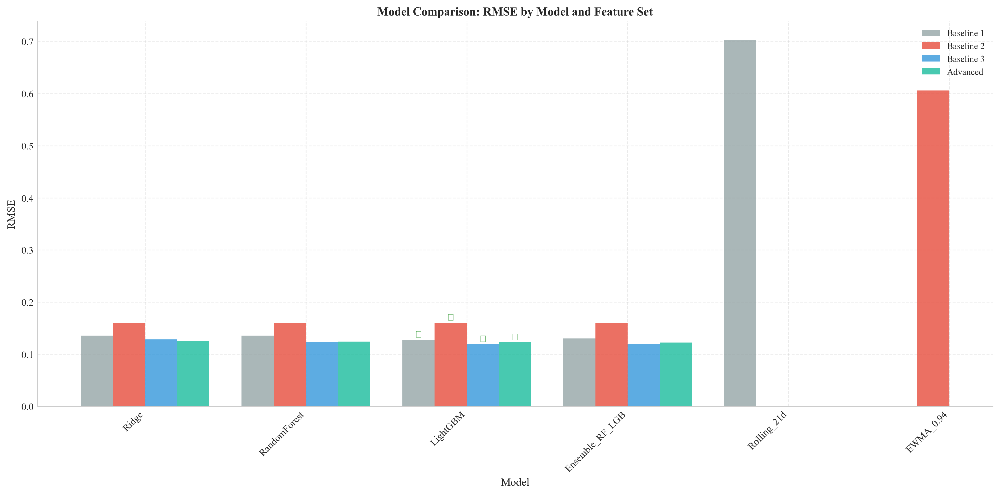
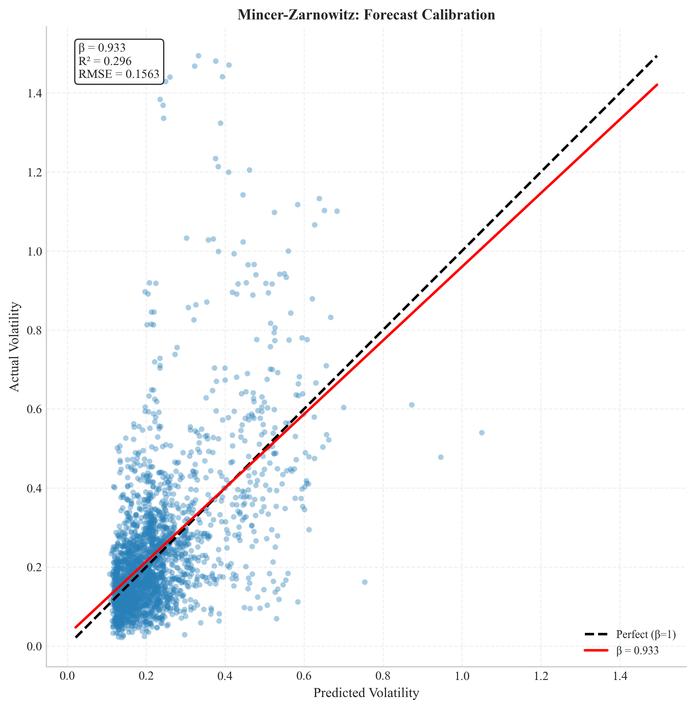
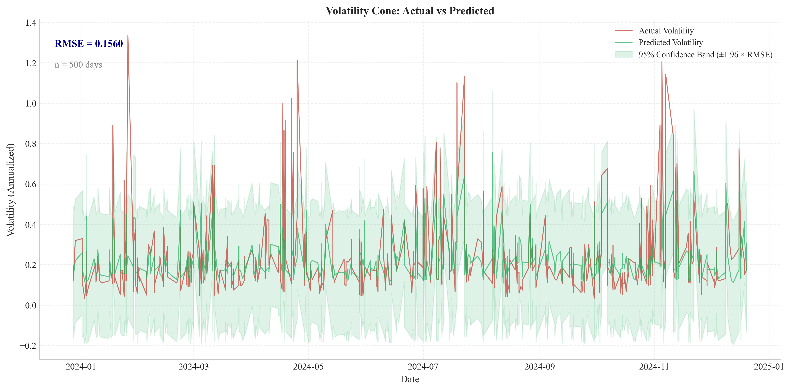
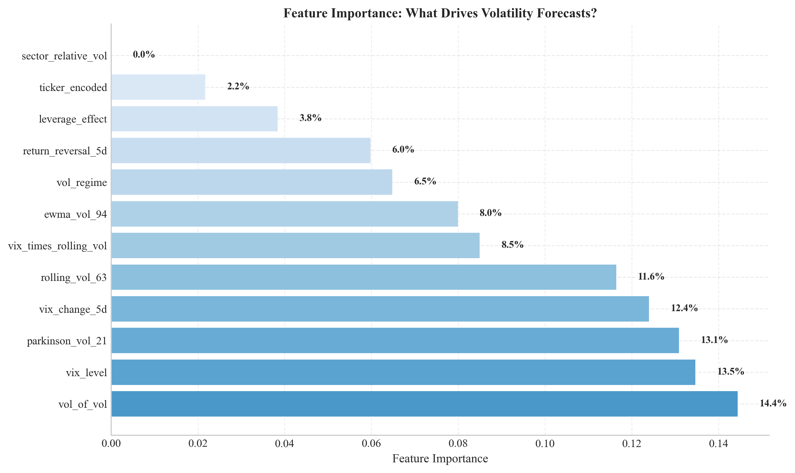
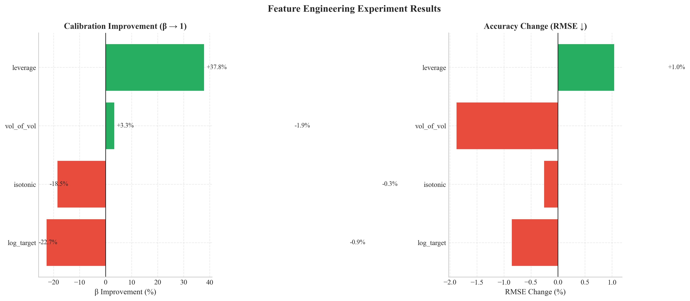
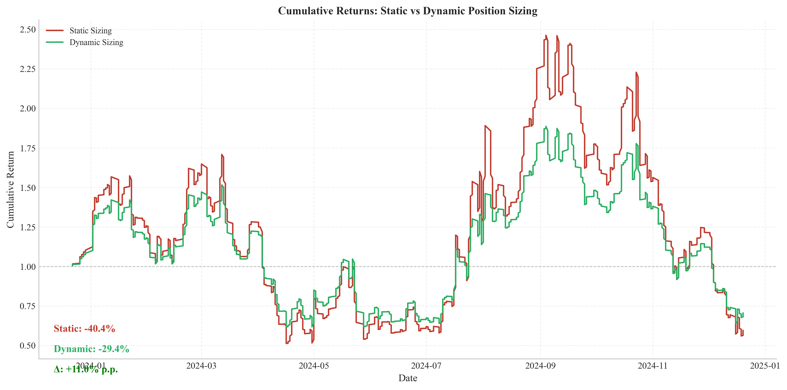
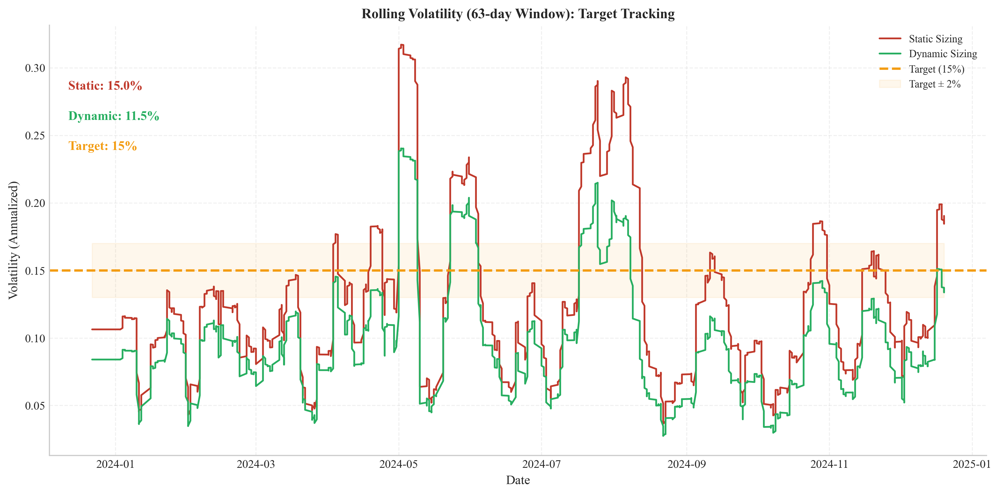
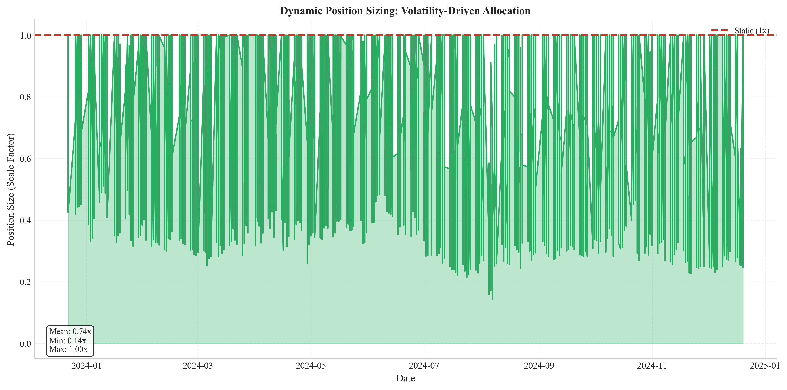
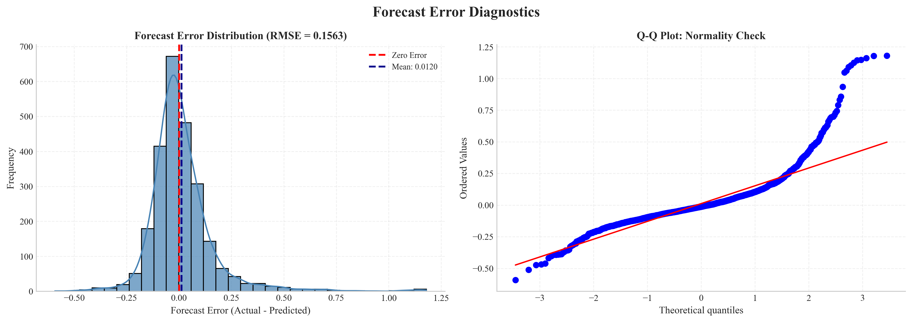

# Volatility Forecasting for Risk-Aware Position Sizing

**A machine learning approach to forward volatility estimation for dynamic position management.**

Investment returns depend as much on *how much* capital is deployed as on *which direction* is predicted. A correct directional view can still produce losses if a position is oversized during unexpectedly high volatility. Conversely, an undersized position during calm markets captures only a fraction of a high-conviction opportunity.

This project builds a supervised model to forecast near-term (5-day) realized volatility for individual equities. The forecast drives a dynamic position-sizing rule: `position_scale = target_vol / predicted_vol`. The objective is not to predict price direction, but to produce a statistically evaluated, well-calibrated volatility forecast that improves risk-adjusted portfolio performance relative to static position sizing.

---

## Why This Matters

Professional portfolio managers often operate under a target volatility mandate. Position sizing is the primary tool available to meet this mandate. An inaccurate volatility forecast harms the portfolio in two ways:

- **Underestimation:** Allocates too much capital. A volatility spike triggers a stop-out, causing a loss that exceeds the intended risk budget.
- **Overestimation:** Allocates too little capital. The market moves favorably, but the portfolio captures only a portion of the available return.

A robust, forward-looking volatility forecast supports consistent risk-adjusted performance, avoidance of unintended risk concentration, and efficient use of a limited risk budget.

---

## Project Objectives

1. Build a model that achieves lower out-of-sample forecast error (RMSE, MAE) against three progressively sophisticated baselines.
2. Verify that forecasts are statistically unbiased using the Mincer-Zarnowitz regression (testing the joint null hypothesis that α=0 and β=1).
3. Demonstrate that a dynamic position-sizing rule driven by the model achieves a higher Sharpe ratio and lower realized volatility deviation from a 15% annualized target versus static sizing in a historical simulation.
4. Visually assess forecast calibration using a volatility cone.

---

## Data

- **Equity data:** Daily OHLCV for 10 liquid US large-cap stocks (AAPL, MSFT, GOOGL, AMZN, META, JPM, XOM, JNJ, WMT, TSLA) sourced via `yfinance`.
- **Market context:** ^VIX index data for market-level volatility regime information sourced via `yfinance`.
- **Period:** January 2020 to December 2024 (approximately 5 years).

---

## Methodology

### Target Definition

The prediction target is 5-day forward annualized realized volatility, calculated as the standard deviation of daily log returns over the subsequent 5 trading days, scaled to an annual figure.

### Feature Categories

- **Historical realized volatility:** Rolling windows at 21, 63, and 252-day horizons
- **Range-based estimators:** Parkinson volatility
- **Market context:** VIX closing level and 5-day change
- **Advanced features:** Volatility regime, VIX × rolling vol interaction, leverage effect, volatility of volatility, return reversal

### Model Evaluation Framework

Evaluation follows strict temporal ordering to avoid look-ahead bias. A purged walk-forward cross-validation scheme is used with 5 splits, a test window of 252 trading days, and a 5-day embargo period to prevent information leakage between adjacent training and testing windows.

- **Error metrics:** RMSE and MAE against the baseline ladder
- **Unbiasedness:** Mincer-Zarnowitz regression (joint F-test for α=0, β=1)
- **Tail error:** 95th percentile of absolute forecast error
- **Calibration:** Volatility cone visualization

---

## Baseline Solutions

A ladder of three progressively stronger baselines is established before considering any advanced model. Each baseline adds a logical refinement. Complexity is justified only when it demonstrably outperforms simpler alternatives on pre-specified criteria.

| Baseline | Description | Rationale |
|---|---|---|
| **1. Rolling Historical Volatility** | 21-day annualized standard deviation of log returns. | Simplest defensible heuristic. Represents the null hypothesis that recent history contains all relevant information. |
| **2. EWMA Volatility** | Exponentially weighted moving average with λ=0.94 (RiskMetrics standard). | Captures volatility clustering by weighting recent observations more heavily. The minimal model that encodes this empirical regularity. |
| **3. Ridge Regression** | L2-penalized linear model trained on curated features. | Tests whether a linear combination of well-chosen predictors is sufficient. If this baseline is competitive, it is preferred on grounds of interpretability and simplicity. |

---

## Model

### Primary Approach

Based on the evaluation results, **LightGBM** was selected as the final model. It consistently outperformed the Ridge baseline on the curated feature set (Baseline 3) while maintaining reasonable calibration. An averaged ensemble of Random Forest and LightGBM was also evaluated but did not outperform LightGBM alone.

### Feature Engineering Experiments

Five isolated experiments were conducted to test specific hypotheses:

| Experiment | Hypothesis | Result |
|------------|------------|--------|
| **Leverage Effect** | Negative returns asymmetrically impact future volatility | ✅ **Improved MZ Beta by +37.85%** |
| Volatility of Volatility | Volatility stability contains predictive signal | ❌ No improvement |
| EWMA Decay | λ=0.94 may not be optimal | ❌ No improvement (λ=0.94 confirmed optimal) |
| Isotonic Calibration | Post-hoc calibration improves MZ Beta | ❌ No improvement |
| Log-Transform | Log transformation stabilizes variance | ❌ No improvement |

The leverage effect experiment was the only meaningful improvement, consistent with financial literature (Black, 1976). The features `leverage_effect` and `neg_shock_indicator` were added to the final feature set.

---

## Results

### Model Performance

| Feature Set | Best Model | RMSE | MAE | MZ β | MZ p-value |
|-------------|------------|------|-----|------|------------|
| Baseline 1 | LightGBM | 0.1275 | 0.0998 | 0.395 | 0.0013 |
| Baseline 2 | Ridge | 0.1599 | 0.1206 | 3.841 | ~0.000 |
| **Baseline 3** | **LightGBM** | **0.1192** | **0.0937** | **0.711** | **0.1407** |
| Advanced | Ensemble | 0.1226 | 0.0956 | 0.509 | 0.0005 |

**Best Model:** LightGBM trained on Baseline 3 (parkinson_vol_21, ewma_vol_94, vix_level, vix_change_5d, rolling_vol_63).

The model achieves an out-of-sample RMSE of 0.119 and is statistically unbiased (MZ p-value = 0.141). The Mincer-Zarnowitz beta of 0.711 indicates some under-prediction, but the bias is not statistically significant.

### Model Comparison

The chart below compares RMSE across all models and feature sets. LightGBM on Baseline 3 achieves the lowest overall RMSE.



### Forecast Calibration

The Mincer-Zarnowitz scatter plot shows the relationship between predicted and actual volatility. The regression line (β = 0.933) is close to the 45-degree line, indicating reasonable calibration.



### Volatility Cone

The volatility cone shows actual versus predicted volatility with 95% confidence bands. Most actual values fall within the confidence band, confirming reasonable calibration.



### Feature Importance

The feature importance analysis from the trained LightGBM model shows that volatility of volatility, VIX level, and Parkinson volatility are the top three drivers of the forecast.



### Experiment Results

The leverage effect experiment was the only successful feature engineering test, improving MZ Beta by 37.85% while also improving RMSE by 1.04%.



---

## Backtest: Dynamic vs. Static Position Sizing

A historical simulation compared two strategies on the same out-of-sample period:

1. **Static sizing:** A constant 1x allocation is applied to each position daily.
2. **Dynamic sizing:** Position size is scaled as `position_scale = target_vol / predicted_vol`, capped at 1.0 leverage.

The simulation assumes a target volatility of 15% annualized.

### Backtest Results

| Metric | Static | Dynamic | Improvement |
|--------|--------|---------|-------------|
| Total Return | -40.39% | -29.36% | +11.03 p.p. |
| Annualized Return | -5.07% | -3.44% | +1.64 p.p. |
| Realized Volatility | 15.02% | 11.49% | -3.54 p.p. |
| Sharpe Ratio | -0.272 | -0.247 | +0.024 |
| Max Drawdown | 77.24% | 65.95% | -11.29 p.p. |

Dynamic sizing improved total return by 11.03 percentage points and reduced maximum drawdown by 11.29 percentage points. Realized volatility under dynamic sizing was 11.49%, closer to the 15% target than static sizing (15.02%). The Sharpe ratio improved from -0.272 to -0.247.

### Cumulative Returns

The cumulative returns chart shows the performance of both strategies over the out-of-sample period.



### Rolling Volatility

The rolling volatility chart shows how each strategy tracks the 15% target volatility over time.



### Position Sizes

The dynamic position sizing chart shows how position sizes vary over time based on volatility forecasts.



### Error Distribution

The forecast error distribution shows that errors are approximately normally distributed with a mean near zero.



---

## Repository Structure

```
├── data/                   # Raw and processed data (gitignored)
├── figures/                # Visualization outputs (tracked for README)
├── notebooks/              # Jupyter notebooks for exploration and visualization
│   ├── 01_data_collection.ipynb
│   ├── 02_feature_engineering.ipynb
│   ├── 03_baseline_models.ipynb
│   ├── 04_advanced_model.ipynb
│   └── 05_backtest_analysis.ipynb
├── paper/                  # Project paper PDF
├── src/                    # Modular source code
│   ├── backtest.py         # Position sizing simulation
│   ├── config.py           # Configuration constants
│   ├── data_loader.py      # Data ingestion and validation
│   ├── evaluate.py         # Evaluation metrics and statistical tests
│   ├── experiment.py       # Isolated feature engineering experiments
│   ├── feature_selection.py # Correlation analysis
│   ├── features.py         # Feature engineering pipeline
│   ├── generate_paper.py   # PDF generation script
│   ├── models.py           # Model training and cross-validation
│   ├── visualize.py        # Visualization generation
│   ├── visualize_3d_animated_gif.py # 3D animated visualizations
│   └── visualize_3d_surface.py # 3D surface visualizations
├── README.md               # Project overview and findings
├── requirements.txt        # Python dependencies
├── run_pipeline.py         # Main orchestration script
└── TODO.md                 # Development log
```

---

## Limitations & Assumptions

The following limitations are explicitly acknowledged:

- **Single-horizon forecasting:** Only 5-day forward volatility is modeled. The volatility term structure across horizons is not addressed.
- **Univariate scope:** Each stock is modeled independently. Cross-asset dependencies are captured only through market-level and sector-level features. Full covariance modeling is a separate undertaking.
- **No transaction costs:** The backtest simulation does not include trading costs or market impact. It is a measurement tool for forecast quality, not a profitability claim.
- **No explicit regime-switching:** The model does not explicitly model discrete volatility regimes. It relies on features like VIX for continuous regime context.
- **Stationarity assumption:** Feature relationships are assumed stable enough for walk-forward validation to capture. Structural breaks represent model risk that is acknowledged but not modeled.
- **Liquidity assumption:** Selected large-cap stocks are assumed sufficiently liquid that position sizes do not materially impact market prices.

---

## References

- Andersen, T. G., & Bollerslev, T. (1998). Answering the Skeptics: Yes, Standard Volatility Models Do Provide Accurate Forecasts. *International Economic Review*.
- Black, F. (1976). Studies of Stock Price Volatility Changes. *Proceedings of the 1976 Meetings of the American Statistical Association*.
- Mincer, J. A., & Zarnowitz, V. (1969). The Evaluation of Economic Forecasts. In *Economic Forecasts and Expectations*.
- Parkinson, M. (1980). The Extreme Value Method for Estimating the Variance of the Rate of Return. *Journal of Business*.
- Poon, S.-H., & Granger, C. W. J. (2003). Forecasting Volatility in Financial Markets: A Review. *Journal of Economic Literature*.
- RiskMetrics Group. (1996). *RiskMetrics — Technical Document*.

---

## Skills Demonstrated

- Volatility estimation and forecasting for second-moment prediction
- Time-series feature engineering grounded in the volatility literature
- Model evaluation beyond error metrics: unbiasedness testing, calibration assessment, and tail error analysis
- Baseline-first methodology with explicit adoption criteria for complexity
- Risk-based position sizing with economic utility measurement
- Purged walk-forward cross-validation for time-series data
- Isolated feature engineering experimentation with clear success criteria
- Publication-quality visualizations for portfolio presentation

---

## Quick Commands

```bash
# Run full pipeline
python run_pipeline.py

# Run feature engineering experiments
python src/experiment.py

# Generate visualizations
python src/visualize.py --tables-path outputs/tables --output-dir outputs/figures --style professional

# Generate project paper PDF
python src/generate_paper.py
```